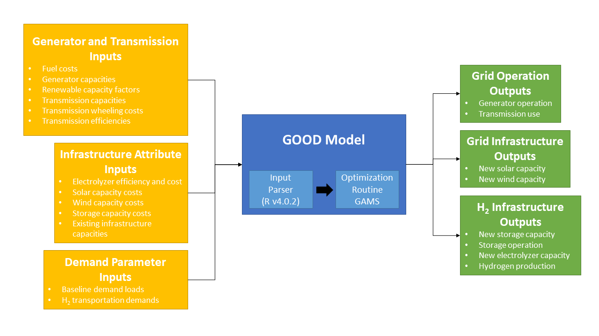

# California Spatial Modeling Project

This GitHub repository houses the University of California, Davis Energy Futures Program's spatial model of the transportation and electricity grid system in California to investigate scenarios of a hydrogen economy.  The project is divided into a transport demand and infrastructure module and an electricity grid module.

## Travel Demand Module (STIEVE)
*Documentation forthcoming*

## Electricity Grid Module (GOOD)
The electricity grid module is a sub-version of the Grid Operation Optimized Dispatch (GOOD) model.  The model is a detailed economic dispatch model with simplified capacity expansion capabilities.  The base version of the GOOD model simulates the operation of power plants across a regional specification given an input electricity demand load.  In the California Spatial Modeling Project, the GOOD model is modified to operate in the Western Interconnect and contains specific modifications to enable hydrogen production and storage.  Below is a model diagram that provides a basic schematic of data flow into the model, a breakdown of the major parsing components of the model and the GOOD solver, and the outputs resulting from model runs.  The GOOD platform is run with two software systems: [R](https://www.r-project.org/) and [GAMS](https://www.gams.com/).  The current instation of the model uses R v4.0.2 and GAMS v25.1.3 (with the CPLEX solver), though any subsequent versions should be compatible.

#### File description ####
Below we cover the contents of the grid module within this GitHub repository.  This overview should provide users with a basic understanding of the structure and relationship of all the critical model files to execute the model.

*base.r* - This is the base file for the GOOD model which loads all of the libraries and helper functions used in subsequent .r files.

*good.gms* - This file is the optimization routine run by the General Algebraic Modeling Software (GAMS).  The file contains the mathematical formulation that minimizes costs for the economic dispatch subject to a series of constraints:
1. Generation must meet load demand (baseload demand, import/export balancing, storage balancing, and H2 production)
2. Renewable portfolio standards must be met in a given year
3. Storage state-of-charge must be balanced in each time period
4. Hydrogen transport demand must be fulfilled by production of hydrogen from grid electrolyzers
5. Storage state-of-charge cannot exceed the total capacity of storage installed
6. Flow of hydrogen into storage cannot exceed the capacity of production from electrolyzers
7. Flow of hydrogen out of storage cannot exceed the combustion turbine capacity to produce electricity
8. Transmission import limits into California
The file contains many of the static infrastructure attribute and cost assumptions including: transmission efficiency; electrolyzer efficiency; hydrogen combustion efficiency; solar, wind, electrolyzer, and storage capacity costs.  All other parameter and scalar assumptions are fed into the model through a wrapper procedure from the *good.r* file.

*good.r* - This file is "master" operational program of the GOOD modeling system.  *good.r* both parses data in preparation for input into the GAMS program as well as executes the model runs.  Minimal parsing occurs within this file; attributes related to hydrogen mobility demand are executed from the *prep-inputs-mobility.r* file while the grid inputs are parsed via the *prep-inputs-grid.r* file.  This file calls on both of the *prep-input* R files before initializing the *good.gms*, setting up a local directory to execute individual runs where a single input file is compiled, as well as the .gms file specific to the model run.  The model operates in 5 year increments and can easily customized to run scenarios based on changes to sets of inputs or to the optimization structure itself.  A single "allYears" execution will run the model from 2025 through 2050 in sequence, as information about infrastructure capacities must be passed on to subsequent year runs.

*prep-inputs-grid.r* - This file parses prepared grid infrastructure files (not included within the GitHub repo):
* inputs_load.csv - baseload electricity demand (sets: time and region)
* inputs_region_key.csv - region mapping file
* inputs_rps.csv - renewable portfolio standards requirements across all regions (sets: region)
* inputs_solarCF.csv - solar capacity factors (sets: time and region)
* inputs_transmission.csv - transmission capacities and costs (sets: region pairs)
* inputs_windCF.csv - wind capacity factors (sets: time and region)
* raw_generators_aggregated.csv - aggregated generators by fuel type and fuel costs
* raw_generators_other.csv - all non-renewable generator attributes
* raw_generators_solar_wind.csv - all renewable generator attributes
* TAZ_IPregion.csv - region mapping for mobility model
The file loads the necessary inputs and parses them based on the scenario being run and prepares them into a list structure that is later transformed as a single *input.gdx* file for each model run.  The file also runs inputs for previous years in the sequence for a model run in order to extract information about capacities that are then used in subsequent model year runs.

(for access to data files, please contact: ajenn@ucdavis.edu)

*prep-inputs-mobility.r* - This file references the infrastructure module outputs to extract the hydrogen fuel demand determined by the STIEVE model.  Without the *outputs.gdx* files for corresponding years to the GOOD model runs, the electricity model will not be able to determine the *h2Demand* parameter.

(for access to example STIEVE model outputs, please contact: ajenn@ucdavis.edu)

*parse-outputs.r* - This file is an auxiliary operation to the execution of the model, but is included for ease of output processing.  The file will extract all the data from the individual *outputs.gdx* files produced by each model run into a single list with separate data tables for every parameter and variable.  Additionally, the *parse-outputs.r* file produces a variety of diagnostic charts based on key points of interest in the model.  These include (but are not limited to) plots on grid operation, capacity expansion, hydrogen infrastructure operation, and emissions.