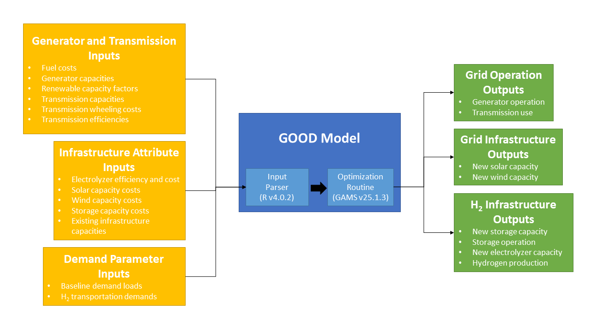

# California Spatial Modeling Project

This GitHub repository houses the University of California, Davis Energy Futures Program's spatial model of the transportation and electricity grid system in California to investigate scenarios of a hydrogen economy.  The project is divided into a transport demand and infrastructure module and an electricity grid module.

## Travel Demand Module
*Documentation forthcoming*

## Electricity Grid Module
The electricity grid module is a sub-version of the Grid Operation Optimized Dispatch (GOOD) model.  The model is a detailed economic dispatch model with simplified capacity expansion capabilities.  The base version of the GOOD model simulates the operation of power plants across a regional specification given an input electricity demand load.  In the California Spatial Modeling Project, the GOOD model is modified to operate in the Western Interconnect and contains specific modifications to enable hydrogen production and storage.  Below is a model diagram that provides a basic schematic of data flow into the model, a breakdown of the major parsing components of the model and the GOOD solver, and the outputs resulting from model runs.  The GOOD platform is run with two software systems: [R](https://www.r-project.org/) and [GAMS](https://www.gams.com/).  The current instation of the model uses R v4.0.2 and GAMS v25.1.3 (with the CPLEX solver), though any subsequent versions should be compatible.

*base.r* - This is the base file for the GOOD model which loads all of the libraries and helper functions used in subsequent .r files.

*good.gms* - This file is the optimization routine run by the General Algebraic Modeling Software (GAMS).  The file contains the mathematical formulation that minimizes costs for the economic dispatch subject to a series of constraints:
1. Generation must meet load demand (baseload demand, import/export balancing, storage balancing, and H2 production)
2. Renewable portfolio standards must be met in a given year
3. Storage state-of-charge must be balanced in each time period
4. Hydrogen transport demand must be fulfilled by production of hydrogen from grid electrolyzers
5. Storage state-of-charge cannot exceed the total capacity of storage installed
6. Flow of hydrogen into storage cannot exceed the capacity of production from electrolyzers
7. Flow of hydrogen out of storage cannot exceed the combustion turbine capacity to produce electricity
8. Transmission import limits into California
The file contains many of the static infrastructure attribute and cost assumptions including: transmission efficiency; electrolyzer efficiency; hydrogen combustion efficiency; solar, wind, electrolyzer, and storage capacity costs.  All other parameter and scalar assumptions are fed into the model through a wrapper procedure from the *good.r* file.

*good.r*
*prep-inputs_grid.r*
*prep-inputs-mobility.r*

*parse-outputs.r*

*inputs*

(for access to data files, please contact: ajenn@ucdavis.edu)

*runFiles*
